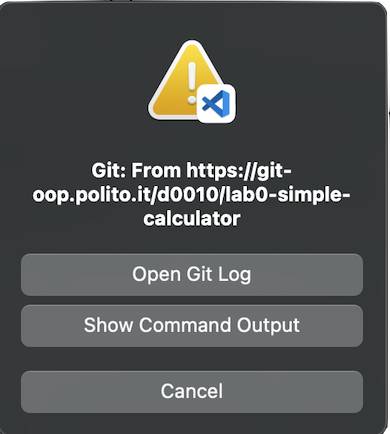
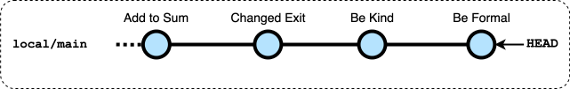

# Lab0 - Simple Calculator

L'obiettivo di questo laboratorio è quello di imparare le basi delle operazioni con *git*.

Tutte le operazioni *git* descritte qui possono essere eseguite usando l'interfaccia grafica oppure la Linea Comandi (CLI) fornita dal Terminale.

## 1. Clona un repository utilizzando VSCode e git.

-  Su GitLab clicca il pulsante blu "`Codice`" e poi "`Clona con HTTPS`" per copiare il link al repository
    - se usate VSCode installato sul vostro computer potete cliccare su `Visual Studio Code (HTTPS)`
-  In VSCode clona il repository:
    - Nella schermata di benvenuto seleziona "`Clona repository Git...`  
    oppure  
    [`Ctrl`] [&#x21e7;] `P` or [&#x2318;] [&#x21e7;] [`P`] per la command palette, scrivere *Clone* e selezionare *Git: Clone*
    - Inserisci l'URL di questo repository quella copiata fa GitLab al passo precedente
    - Seleziona una posizione nel file system
        in Crownlabs `/vscode/workspace` (preservato in caso di crash)
    - Inserisci il nome utente (es. s999999) e la la password
    - Conferma che vuoi aprire il progetto

## 2. Crea un'applicazione calcolatrice basata sulla console in Java

-  In VSCode completa il codice per l'applicazione
    - Deve eseguire le operazioni aritmetiche di base: addizione, sottrazione, moltiplicazione e divisione
    - La maggior parte del codice è già presente in `Calculator.java`, manca l'operazione di sottrazione

-  In VSCode, clicca sul pulsante Test sulla sinistra 
    - Espandi i contenuti fino a trovare `TestCalculator.java`
    - Clicca sul simbolo di esecuzione &#x23F5; accanto al file
    - Se un test fallisce compare un cerchio con una X rossi, leggi il messaggio e correggi il programma.
        (la prima volta fallirà perchè il codice per la sottrazione manca)
    - Se i test hanno successo compare un cerchio con un check verdi. 


## 3. Carica tutti i file sul repository remoto

-  In VSCode effettua il *commit* e invia il tuo codice:
    - Clicca sul pulsante Controllo Sorgente  per aprire il pannello di Controllo Sorgente
    - Vedrai le modifche, in particolare `Calculator.java`, la **M** alla sua destra indica che il file è stata modificato
    - È possibile vedere le modifiche fatte cliccando su `Calculator.java`
    - Aggiungi `Calculator.java` agli "Staged Changes" cliccando sul "`+`" accanto ad esso
        - CLI: `$ git add src/calc/Calculator.java`
    - Inserisci il messaggio di commit (sopra il pulsante "Commit"): "First Version" e clicca sul pulsante "`Commit`"
        - CLI: `$ git commit --message "First Version"`
        - Attenzione: se si dimentica di inserire il commento viene aperto un editor
            in cui è possibile scrivere il messaggio, salvare e poi cliccare sul check in alto a destra per procedere
    - Cliccare sul pulsante `Sync Changes` (che prima era *Commit*) per fare il push sul repository remoto.
        - CLI: `$ git push`

-  Su GitLab riapri (o aggiorna) la pagina web con il repository remoto
    - Vedrai in cima alla pagina un riquadro con l'ultimo commit che hai appena inviato
    - Clicca sul messaggio (es. "First Version") per vedere tutti i cambiamenti nel commit

## 4. Effettua una modifica utilizzando l'interfaccia web di GitLab

-  Su GitLab, nel repository, sposta la stampa di "Simple Calculator" prima del ciclo e committa la modifica
    - Torna alla pagina principale del progetto
    - Apri la cartella `src/calc`
    - Clicca sul file `Calculator.java`
    - Clicca sul pulsante blu `Edit` e seleziona `Edit single file` per iniziare a modificare il file
    - Apporta la modifica nell'area dell'editor: sposta la stampa di "Simple Calculator" prima del ciclo
    - Scrivi il messaggio di commit "Moved Greeting"
    - Clicca su `Commit`

## 5. Aggiorna il repository locale con un Pull

-  In VSCode sincronizza i cambiamenti:
    - Clicca sui '...' che compaiono muovendo il puntatore a fianco di "SOURCE CONTROL" (quello inferiore)
    - Seleziona `Pull`
        - CLI: `$ git pull`
      
      Questa operazione aggiornerà i contenuti della copia di lavoro con i nuovi cambiamenti remoti
    - Controlla nelle finestre dell'editor che `Calculator.java` contenga ora il codice modificato

**Nota Bene**: questa è la procedura occorre eseguire ogni volta prima di iniziare a lavorare, per assicurarsi di avere nella working copy gli ultimi cambiamenti.


## 6. Esegui due modifiche contemporanee in GitLab e in VSCode

Simuliamo cosa succede se due sviluppatori fanno contemporaneamente dei commit sullo stesso file.

-  Su GitLab, cambia l'elemento del menu `"Add"` in `"Sum"` e fai il commit con il messaggio "*Add to Sum*"

-  In VSCode, cambia il valore della costante `EXIT` in `0` e aggiorna la stringa del prompt `(1-5)` che diventa `(0-4)`
    - Fai il *Commit* con messaggio "*Changed exit*"
        - CLI  `$ git commit -a --message "Changed exit"`
    - Clicca su *Sync Changes* (push)
        - CLI: `$ git push`
        
        VSCode segnala un errore

        
    
    - clicca sul pulsante `Show Command Output`, si legge il messaggio:

    ```
    ...
    hint: Updates were rejected because the remote contains work that you do
    hint: not have locally. This is usually caused by another repository pushing
    hint: to the same ref. You may want to first integrate the remote changes
    hint: (e.g., 'git pull ...') before pushing again.
    ```


## 7. Risolvi i commit divergenti con Rebase

I due commit contemporanei hanno portato i repository, remoto e locale, alla situazione descritta dai seguenti grafi di commit:


Il push è stato rifiutato perché il repository locale e quello remoto sono divergenti dopo il commit `("Moved Greeting")`.


-  In VSCode aggiorna il repo locale

    - apri il pannello di Controllo Sorgente clicca sui "..." (puntini) e poi `Pull`
        - GIT `$ git pull`

        il comando generato un errore e l'output del comando riporta:

        ```
        ...
        hint: You have divergent branches and need to specify how to reconcile them.
        hint: You can do so by running one of the following commands sometime before
        hint: your next pull:
        ...
        ```

    Il Pull (Fetch + Checkout) è fallito poiché due commit sono candidati a diventare HEAD del ramo principale, solo la parte Fetch è stata eseguita, l'attuale repository contiene due commit divergenti

    

    L'opzione più semplice per risolvere il problema è fare il "Rebase" dei commit locali dopo i commit remoti

-  In VSCode fai un rebase
    - apri il pannello di Controllo Sorgente clicca sui "..." (puntini), `Pull, Push` e poi `Pull (Rebase)`
        - CLI: `git pull --rebase`

    Dopo il rebase, il repository contiene un unica sequenza di commit

    

    Ora c'è un commit (il "Changed Exit") fatto il rebase dopo quello remoto ("Add to Sum").
    
    Git ha combinato automaticamente le modifiche del commit locale in modo che siano applicate
    in sequenza dopo quelle del commit remoto.

-  In VSCode sincronizza i cambiamenti:
    - Cliccare sul pulsante `Sync Changes` nel pannello di Controllo Sorgente
        - CLI: `git push`

-  Su GitLab riapri (aggiorna) la pagina web con il repository remoto e verifica che tutti i cambiamenti siano ora presenti lì


## 8. Esegui due commit contemporanei conflittuali

Simuliamo cosa succede se due sviluppatori fanno contemporaneamente dei commit che impattano le stesse righe di un file. In questo caso git non è in grado di combinare automaticamente le modifiche.

-  Su GitLab, cambia i due `"Enter ... number"` in `"Plase, enter ... number"` e fai il commit con il messaggio "*Be kind*"

-  In VSCode, 
    - Cambia i due `"Enter ... number"` in `"Enter ... operand"` 
    - Fai il commit con il messaggio "*Be Formal*"
        - CLI  `$ git commit -a --message "Be Formal"`

    - Nel pannello di Controllo Sorgente clicca su `Sync Changes` (pull)
        - CLI `$ git pull`
    
        il comando genera un errore come nel caso precedente a causa dei commit divergenti
    - Clicca sul pulsante `Cancel` per chiudere la dialog

Il repository locale contiene


## 9. Risolvi i commit conflittuali

-  In VSCode 
    - Nel pannello di Controllo Sorgente clicca sui "..." (puntini), `Pull, Push` e poi `Pull (Rebase)`
        - GIT `$ git pull --rebase`
        
        Riceverai un messaggio di errore, simile al precedente.
        
        Questo è dovuto al fatto che le due modifiche sono in **conflitto** (sono sulle stesse linee) e git non è in grado di conciliarle automaticamente

    - Nel tab del Source Control c'è una sezione "*Merge Changes*" in cui compaiono i file che
      hanno dei conflitti (`Calculator.java`) evidenziati in rosso e con un `!` sulla destra

    - Clicca su `Show Changes` o apri `Calculator.java` nell'editor per vedere i cambiamenti in conflitto
        - Nella finestra dell'editor vedrai i conflitti delimitati da `<<<<<<< HEAD` e `>>>>>>> ... (Be formal)`:

        ```diff
        ...
        <<<<<<< HEAD
            out.print("Please, enter first number: ");
            num1 = scanner.nextDouble();
            out.print("Please, enter second number: ");
        =======
            out.print("Enter first operand: ");
            num1 = scanner.nextDouble();
            out.print("Enter second operand: ");
        >>>>>>> 79add5b (Be formal)        
        ...
        ```
        
        - Per risolvere il conflitto è necessario modificare il codice combinando i cambiamenti e rimuovere i marcatori di conflitto, ad esempio come segue:

        ```java
        ...
            out.print("Please, enter first operand: ");
            num1 = scanner.nextDouble();
            out.print("Please, enter second operand: ");
            num2 = scanner.nextDouble();
        ...
        ```

    - Clicca sul `+` a fianco del file modificato per aggungerlo al commit che risolve i conflitti
        - CLI `$ git add src/calc/Calculator.java`

    - Clicca su `Continue` nel pannello di Controllo Sorgente per completare l'operazione di rebase.
        - CLI `$ git rebase --continue --message "Be Formal"`

      Ora il repository locale contiene

      

    - Sincronizza i cambiamenti con il pulsante `Sync Changes`
        - CLI `$ git push`

-  Su GitLab, nel menu a sinistra seleziona `Code` e poi `Respository graph`
    - vedrai il grafico dei commit del repository

---
Version: 2.0.1
